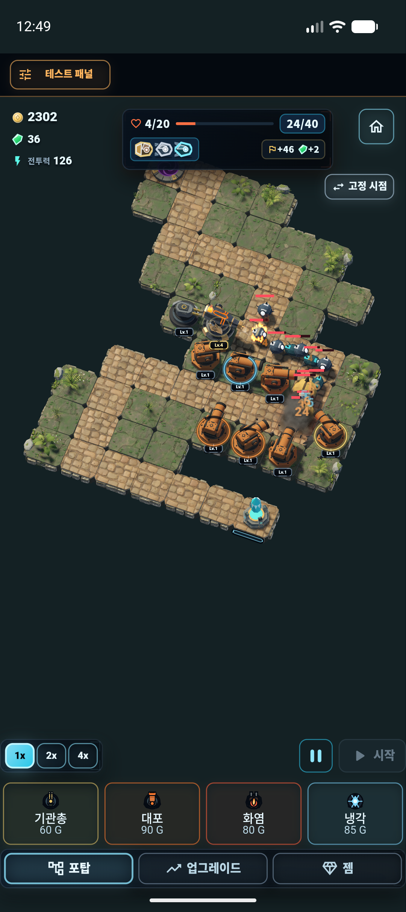

# Flutter 전투 호스트 대체 검증 — 2026-09-21

[Flutter 제거 로드맵](../../godot_unified_app_roadmap.md)의 1단계를 구현·검증했다. 전체 Flutter 앱 제거 완료를 뜻하지 않는다.

## 변경과 남은 경계

- Godot 세션이 전투·효과·코어 붕괴 시간을 진행한다. Android 생산 경로는 Flutter Ticker의 dt/steps와 전장 CustomPaint를 사용하지 않는다.
- Godot이 현재 카메라로 전장 터치·선택 좌표·드래그·핀치를 판정한다. Flutter HUD는 버튼 명령과 선택·건설의 앱 도메인 처리를 유지한다.
- 명령은 상태 변경 시 전송하고 최신 전투 상태는 100ms 간격으로 읽는다. 동일 ACK의 증가한 stateRevision을 수신하고 ackEvent로 이벤트 중복을 막는다. 동일 표시 프레임 재전송도 생략한다.
- Android 비활성/포커스/표면 gate와 활성화 revision으로 정지·복귀를 처리한다. 복귀 첫 프레임 delta를 버린다. TickerMode UI 차단은 사용자 일시정지와 분리한다.
- Flutter 없는 Godot 개발 세션을 제공한다. 기존 1~15 맵·3D 자산·전투를 재사용하며 앱 경제·저장·계정 기능을 대체하지 않는다. 실행법은 [세션 안내](../../../godot/session/README.md).
- 다음 단계는 Dart 런·성장·로컬 저장 대체다. Flutter HUD·로비·인증·온라인 경제·플랫폼 패키징은 남아 있다.

## 자동 검증

| 검사 | 결과·근거 |
| --- | --- |
| Flutter 전체 회귀 | 1,148 통과, 11 건너뜀. [전체 로그](flutter-test.log). 이후 생명주기 보강은 아래 관련 검사로 재검증 |
| 최종 정적 분석 | 문제 없음. [로그](flutter-analyze.log) |
| 세션·프로토콜·뷰 회귀 | 34 통과. 같은 ACK 새 상태, 이벤트 중복, dt 제거, 배속·정지, 100ms 조회, 백그라운드 5초 초과 후 복귀. [로그](session-tests.log) |
| UI 차단 추가 검사 | 최신 TickerMode API 변경 후 2 통과. 정지·입력 차단 및 사용자 일시정지 보존. [로그](ui-block-tests.log) |
| Godot 회귀 | Flutter 하네스 6 통과. 기존 전투·포탑·웨이브·코어·세션 검사. [로그](native-tests.log) |
| 독립 Godot 세션 | 1/6/11/15 진입·레이 좌표·건설·전투·정지·4배속·종료/재진입 PASS. 첫 진입 300초/복귀 600초 delta 폐기 및 정상 delta 보존 PASS |
| Android Kotlin/APK | arm64 Kotlin 컴파일, 최종 APK 빌드 PASS. [빌드 로그](android-build.log) |

## Android 본게임 확인

일반 `lib/main.dart`, 로컬 debug 6028/0.1.20, 디버그 패널 활성, Android emulator-5554 1080×2424, Godot 4.7.2 Vulkan. 공개 배포하지 않았다.

- 기존 23라운드 저장 진입, 포탑 선택·건설 및 90골드 차감/전투력 증가 확인.
- 카메라 드래그와 고정/드론 전환, 1배속 전투·4배속 전환 확인.
- 23→24라운드 진행과 골드·젬 보상 반영 확인.
- 스테이지 메뉴 정지 후 백그라운드 복귀에서 같은 적 배치·재화·피해 통계 유지. 메뉴를 닫으면 다시 진행.
- 진행 중 앱 백그라운드/복귀에서 오류 없이 이어짐. 누적 delta 폐기의 수치 판정은 독립 회귀 검사에서 수행.
- 메인 화면 이동·앱 강제 종료·재실행 후 24라운드 복원 안내, 새 장면 전투 재개 확인.
- 테스트 종료 후 작업 전 앱 데이터 98개 파일을 해시 일치로 복원했다. [복원 결과](data-restore.json).

[1배속·포탑 선택](android-combat-1x.png), [4배속 후 다음 라운드·시점 전환](android-combat-4x.png), [메뉴 정지](android-paused.png), [백그라운드 복귀 정지 유지](android-resume-paused.png), [저장 복원](android-save-restored.png).

최종 APK 실제 전투 화면:

## 용량·한계

최종 로컬 debug APK 560,895,910 bytes. Flutter 라이브러리는 arm64, 기존 Godot 라이브러리는 3 ABI가 포함된다. 기존 로컬 APK 562,391,310 bytes와 빌드 조건이 완전히 같지 않아 용량 개선이나 공개 APK 대비 증감을 주장하지 않는다. PCK는 106,014,844→106,075,272 bytes(+60,428)로 세션 스크립트·개발 fixture 등이 추가됐다. PCK 296개 항목의 완전 중복은 0 bytes. [패키지 구성](package-current.json), [팩 감사](pack-audit.json).

실기기 release/profile FPS·p95/p99·발열·메모리는 미측정이다. 에뮬레이터 Vulkan semaphore 검증 경고가 남아 있으며, 마지막 실행 로그의 GDScript 오류·파싱 오류·fatal exception은 0이다. [로그 집계](android-log-summary.json). 디버그 패널이 켜진 로비에서 하단 14px overflow를 관찰했으며 이번 전투 호스트 범위와 별도로 남긴다. Android 핀치 실조작은 미검증이고 입력 회귀에서 확인했다. Web/iOS/PC 앱 연결·실사용 저장/계정 동등성은 후속 단계다.
