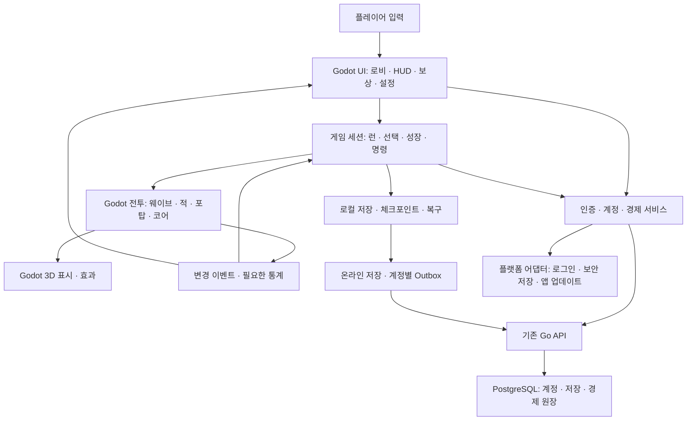
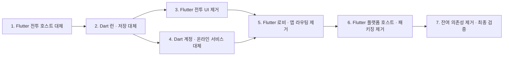

# Flutter 제거 실행 로드맵

역할: 현재 남은 Flutter/Dart 의존성을 대체하고 제거하는 순서·대상·완료 조건.
작성: 2026-09-20. 수정: 2026-09-21. 기준: `732295e` 및 현재 확인한 작업 트리.
상태: Godot 단일 앱이라는 방향과 기존 기능·디자인·저장·API 보존 원칙은 확정. 1단계 전투 호스트 대체를 구현·검증했다. 2~7단계는 남은 제거 작업이며, 전체 앱 이관·배포 완료를 뜻하지 않는다.
적용 범위: Flutter 호스트, Dart 앱 로직, HUD·로비, 저장·인증 클라이언트, 플랫폼 채널, 빌드·배포 의존성.

## 1. 이미 완료된 부분과 이번 작업

**Godot이 게임 클라이언트 전체를 실행하고, Flutter/Dart 런타임과 두 엔진 사이의 전투·표시 브리지를 제거한다.** OS 기능은 얇은 플랫폼 어댑터로 연결한다. Go API·PostgreSQL의 서버 권위 경제와 기존 API·저장 계약은 유지한다. 작업량보다 기능 보존, 일관된 상태 소유권, 성능과 장기 유지보수를 우선한다.

**Flame 제거와 Android 전투·3D 표시의 Godot 이관은 이미 완료된 출발점이다.** 적 이동·공격·명중·웨이브·코어 판정이나 기존 전장을 다시 만드는 단계는 없다. 남은 일은 그 Godot 전투를 감싸고 있는 Flutter 호스트와 앱 기능을 걷어내는 것이다. 방향 재결정·전체 재조사를 별도 선행 단계로 두지 않는다.

전투 HUD 통합은 매 프레임 상태 전달·이중 화면 합성·입력 및 시계 연결을 줄이는 목적이다. 로비까지 통합하는 목적은 클라이언트 구조와 배포 체계의 단일화다. Godot UI가 Flutter보다 항상 빠르다고 가정하지 않으며, UI 재계산·할당·페인트 낭비를 그대로 이식하지 않는다.

| 영역 | 현재 확인된 상태 | 최종 책임 |
| --- | --- | --- |
| Android 스테이지 1~15 전투·3D 표시 | Godot 이관, Flame 의존성·2D fallback 제거 | 기존 Godot 전투·표시 재사용 |
| 전투 시간·전장 입력·카메라 | Godot 세션으로 이관, 앱 도메인 명령·HUD는 임시 브리지 유지 | Godot 전투 세션과 입력 계층 |
| 전투 HUD·보상·결과 | Flutter, 화면 피격·붕괴 연출은 Godot | Godot UI |
| 성장·경제 클라이언트·저장·로비 | Dart/Flutter | Godot 앱 서비스와 UI |
| 인증·세션 보관·업데이트 | Dart 및 Android/Web 연동 | Godot 서비스 + 플랫폼 어댑터 |
| 서버 인증·저장·중요 재화 | Go API·PostgreSQL | 현행 서버 권위 유지 |
| 웹·iOS·PC 전투 | Godot 앱 연결 미완료 | 지원 대상으로 확정한 플랫폼의 독립 Godot 앱 |

현재 상태의 근거는 [전투 책임](godot_combat_migration_boundaries.md), [표시·앱 연결](godot_presentation_migration_plan.md), [NativeGameHost](../lib/ui/hud/native_game_host.dart), [전투 앱 연결](../lib/game/game_native_combat.dart)이다. 기존 문서의 과거 Flutter+Flame 설명을 새 이관의 출발점으로 삼지 않는다.

### 제거 대상과 대체물

| 제거할 의존성 | 현재 위치 | 대체 후의 모습 | 담당 단계 |
| --- | --- | --- | --- |
| Flutter 전투 Ticker·터치·전장 호스트 | `lib/ui/hud/native_game_host.dart`, `godot_battlefield_view.dart` | 기존 Godot 전투에 내부 시계·입력·장면 진입 연결 | 1 |
| Dart 런·성장·정적 정의·로컬 저장 | `lib/game/rune_nexus_game.dart`, `lib/game/systems/`, `lib/data/definitions/`, `lib/data/save/` | Godot 도메인·호환 저장 서비스 | 2 |
| Flutter HUD와 표시용 전체 스냅샷 | `lib/ui/hud/`, `lib/ui/game/`, `lib/game/game_snapshot*.dart` | Godot UI가 필요한 상태 변경만 구독 | 3 |
| Dart 인증·온라인 저장·경제 API와 Outbox | `lib/data/auth/`, `lib/data/save/online_*`, `lib/data/economy/` | 기존 서버에 연결하는 Godot 서비스 | 4 |
| Flutter 로비·화면 라우팅·설정 | `lib/app/`, `lib/ui/menu/`, `lib/ui/settings/` | Godot 앱 진입·전체 화면 흐름 | 5 |
| Flutter MethodChannel·플랫폼 합성·패키징 | `lib/platform/`, Android Flutter 호스트·브리지, 배포 workflows | 얇은 OS 어댑터 + Godot export | 6 |
| 잔여 Dart 미러·Flutter SDK/검사/생성 의존성 | `pubspec.yaml`, 앱 소스·스크립트·CI·개발 가이드 | Flutter/Dart SDK 없이 빌드·실행·검증 | 7 |

경로는 책임 추적 범위이며 디렉터리 일괄 삭제 지시가 아니다. 각 대체 경로를 검증한 뒤 소비자가 없어진 코드부터 제거한다. Kotlin 플랫폼 기능, 기존 저장 읽기와 서버 코드는 필요한 책임을 유지한다.

## 2. 목표 구조

- **상태마다 쓰기 권위는 하나다.** 전투 HP·명중·웨이브는 전투 런타임, 일반 성장·런 선택은 앱 도메인, 중요 재화는 서버가 소유한다. UI는 명령을 보내고 읽기 모델을 표시한다.
- **전투 실행은 Godot 시계를 따른다.** Flutter Ticker가 보내는 `dt`와 명령 배치에 의존하지 않는다. 현재 처리 순서·배속·정지·복구 의미를 유지하며, 물리 틱·고정 스텝 변경을 이관에 섞어 전투 결과를 바꾸지 않는다.
- **UI는 필요한 변경만 구독한다.** 골드·HP·선택·쿨다운·패널 상태를 구분한다. 처치 묶음은 도메인 상태 반영 후 한 번 알리고, 정적 웨이브·성장 정보는 변경 시 갱신한다.
- **서비스는 화면 수명과 분리한다.** 화면 이동·로그아웃·계정 전환에서 저장·경제 요청이 중복되거나 다른 계정에 적용되지 않게 한다.
- **플랫폼 어댑터에는 게임 규칙을 넣지 않는다.** OS API·보안 저장·브라우저 인증/저장 등 플랫폼 차이만 맡긴다. 기존 Kotlin 구현은 계약이 맞으면 재사용한다.

현재 Godot 프로젝트와 언어·렌더링 자산을 우선 재사용한다. 대형 전역 스크립트로 통합하거나 일괄적인 언어 전환·새 엔진 프레임워크 도입을 목표에 추가하지 않는다.

## 3. 단계와 의존 관계

단계 번호는 남은 Flutter 제거의 완료 관문이다. 3과 4는 2의 공통 상태·저장 서비스가 갖춰지면 독립적으로 진행할 수 있다. 완료된 Godot 전투를 미착수로 되돌리지 않는다. 대체 구현을 검증한 부분부터 기존 책임을 끊으며, 모든 코드를 마지막 단계까지 이중 운영하지 않는다.

### 구현과 함께 남길 기록 — 별도 선행 단계 아님

작업:

- 담당 기능을 대체할 때 기존 코드·검사와 완료 증거를 연결한다. 디버그 도구와 맵 편집 등 개발 기능도 누락 여부를 판단한다. 이미 확인한 구조를 다시 조사하는 전체 감사부터 시작하지 않는다.
- Android를 첫 동등성 검증 대상으로 삼는다. Web·iOS·PC는 현행 지원, 목표 지원, 플랫폼별 남은 작업을 구분한다. 기존 공개 플랫폼을 조용히 폐기하지 않는다.
- 동일 기기·릴리스/profile 모드에서 전투 준비, 1배속/4배속, HUD 패널 닫힘/열림, 대량 처치, 코어 피격을 기준선으로 기록한다.
- 저장·설정·세션·일반 저장 Outbox·경제 Outbox의 실제 경로, 형식, 키와 계정 구분을 조사한다. 토큰이나 사용자 원문을 문서·검사 데이터에 남기지 않는다.
- Web의 렌더러·셰이더·저장·인증·호스팅 호환성을 조기 확인한다. 현재 `godot/project.godot`의 Mobile 렌더러 설정만으로 웹 호환을 선언하지 않는다.

이 기록은 각 제거 작업의 검증 자료다. 미측정 실기기 항목은 미측정으로 남기며, 지원 범위 검토가 이미 가능한 Android 구현을 막는 선행 관문이 되지 않게 한다.

### 1. Flutter 전투 호스트 대체

상태: **구현·검증 완료(2026-09-21)**. [검증 기록](analysis/flutter_host_removal_20260921/README.md). Godot 독립 개발 세션과 Android 본게임 연결을 확인했다. Flutter HUD·경제·선택/건설 도메인·저장은 후속 단계에 남아 있으며, 독립 세션은 배포용 앱이 아니다.

제거 대상: `NativeGameHost`의 프레임 공급·입력 소유권과 `GodotBattlefieldView`의 매 프레임 전투/표시 전달 의존성. 기존 Godot 전투 계산과 3D 장면은 유지한다.

작업:

- 기존 Godot 프로젝트의 전투 런타임에 Flutter 없이 호출할 앱 진입·장면 전환 경로를 연결한다. 기존 맵·전투·VFX를 그대로 사용한다.
- 외부 `dt` 공급, 정지·재개·배속·백그라운드 복귀, 로딩 차단과 코어 붕괴 시간 진행을 Godot 세션으로 옮긴다. 한 전투를 외부/내부 루프가 동시에 진행하지 않는다.
- 카메라·터치·선택·건설 좌표 판정을 Godot으로 옮겨 화면 투영의 매 프레임 왕복 의존성을 해소한다.
- 임시 Flutter 호스트 경로는 비교용으로 유지할 수 있지만, 새 경로가 Flutter 없이 실행되는 것을 별도로 확인한다.

완료 조건: 독립 실행에서 스테이지 진입·배치·전투·정지·재개·종료가 가능하고 기존 전투 회귀가 통과한다. 게임 시계가 한 곳에서만 진행되며 장면 재진입 후 이전 이벤트가 적용되지 않는다. 아직 저장·계정 동등성을 갖춘 배포본으로 간주하지 않는다.

### 2. Dart 런·성장·로컬 저장 대체

상태: **진행 중**. v1/v2 호환 codec, 네이티브 로컬 저장·중단 복구, 전투 체크포인트 투영 및 독립 개발 세션의 프로세스 재시작 검증을 구현했다. [저장 기반 검증](analysis/godot_save_foundation_20260921/README.md). 독립 세션의 실제 콘텐츠·전투 설정 경로도 구현·검증했다([콘텐츠 이관 기록](analysis/godot_content_migration_20260921/README.md)). 정적 정의는 Dart 단일 원본에서 생성 JSON으로 전달하며 실행/준비에는 Dart가 필요 없고 재생성 도구 의존은 남아 있다. 독립 세션의 건설·강화·판매·젬·특성·런 업그레이드, 일반 성장·연구·코어·장착과 전투 이벤트 반영도 Godot에서 처리한다([런·성장 검증](analysis/godot_run_growth_20260921/README.md)). Android 본게임의 기존 Flutter 도메인 호출, 계정 정산·퀘스트·저장 및 설치 경로 인계는 아직 남아 있다. 실제 콘텐츠 세션의 저장은 정확한 재구성·경제 연결 전까지 거절한다. 웹 저장 어댑터는 실제 브라우저 검증 전이다.

제거 대상: Godot 전투를 시작·설정·저장하기 위해 Dart의 런 모델과 콘텐츠 정의를 요구하는 의존성. 전투 설정과 사용자 행동 결과를 Godot 도메인에서 만들고 저장한다.

작업:

- Flutter의 정적 설정·포탑 배치·강화·젬·특성·런 업그레이드·일반 성장 계산과 체크포인트 소유권을 Godot 앱 도메인으로 옮긴다. 기존 Godot 피해 계산을 중복 구현하지 않는다.
- 정적 콘텐츠 정의를 단일 원본으로 정리한다. 임시 변환기를 사용할 경우 원본과 생성물을 명시하고 양쪽 수동 수정을 금지한다. 최종 실행에 Dart 생성 도구가 필요하지 않게 한다.
- 현재 저장 v2와 마이그레이션·기본값·ID·수치 의미를 보존한다. 엔진 교체를 이유로 저장 v3나 전투 중 탄환 저장 같은 새 의미를 도입하지 않는다.
- 로컬 우선 저장, 원자적 교체·백업·손상 복구, 계정별 슬롯과 설정을 이관한다. 기존 설치의 실제 저장 위치에서 안전하게 인계하고 전환 도중 종료 시 재시도 가능하게 한다. 기존 `.tmp`·`.replace` 중단 상태, v1 저장 이전, 웹 localStorage 키와 writer lock도 포함한다.
- 이전/새 구현의 상태 결과를 동일 입력 fixture로 비교한다. JSON의 키 순서 차이와 실제 값·타입·기본값 차이를 구분한다.

완료 조건: 기존 저장을 읽고 플레이한 뒤 재시작해 동일 진행을 복구한다. 준비·진행 중 웨이브·보상 대기·패배·재시도 경계와 장착 모듈 ID를 보존한다. 계정 경제 값은 서버 확정 없이 로컬 지급하지 않는다.

### 3. Flutter 전투 HUD·보상·결과 제거

제거 대상: `GameHud`와 전투 패널·오버레이, 화면 경고, HUD 공급을 위한 전체 `GameSnapshot` 생성·구독. 새 UI를 기존 Godot 상태와 2의 앱 도메인에 연결한다.

작업:

- 상단 자원·HP·웨이브, 카메라·배속·자동 시작, 포탑/젬/업그레이드 탭, 코어·포탈·포탑 상세, 건설·장착·교체·환불을 이관한다.
- 보상 카드·젬 대상 지정·교체 확인, 일시정지 메뉴, 복원·성공·실패 화면, 로딩·오류·재시도와 화면 피격 경고를 포함한다.
- 기존 이미지·폰트·레이아웃·색·재질·전환 의미를 Godot `Control`/`Theme` 등으로 재현한다. [디자인 기준](../DESIGNS.md)의 승인 외형과 최종 인게임 판정을 따른다.
- 정적 장식은 재사용하고 숫자·쿨다운 등 동적 부분만 변경한다. 이벤트당 전체 트리 재구축, 값이 같은 텍스트 재할당, 매 프레임 전체 스냅샷 재생성을 피한다.
- 피해 통계 등 표시 주기와 전투 계산 주기를 분리한다. 즉시 필요한 HP·사용자 조작·종료 상태와 낮은 빈도의 통계를 구분한다.

완료 조건: 전투 화면에서 Flutter의 UI·터치·화면 효과가 전혀 필요하지 않다. 실제 게임 크기에서 패널 열림/닫힘, 긴 숫자·한글, 화면비·안전 영역·터치 충돌을 확인한다. 같은 전투 조건으로 CPU 프레임·실제 표시 간격·p95/p99를 비교하고 GPU 수치는 별도로 기록한다.

### 4. Dart 인증·온라인 저장·경제 클라이언트 대체

제거 대상: 앱이 계정·저장·경제 기능을 쓰기 위해 Dart 서비스와 Flutter 플랫폼 채널을 거쳐야 하는 의존성. 서버 기능을 새로 이관하거나 서버 권위를 클라이언트로 옮기는 작업은 아니다.

작업:

- 기존 API와 인증 세션 복원·refresh 회전·single-flight·401 재시도·로그아웃·계정 전환을 Godot 서비스로 구현한다. 갱신 전 영속화하는 pendingKey, logoutPending, API 주소·계정 바인딩을 보존한다. Android Credential Manager/세션 보관은 필요한 부분을 플랫폼 플러그인으로 연결한다.
- 계정별 온라인 저장 Outbox, 단일 in-flight, writer generation, 서버 revision 우선 복구·로컬 백업, rebase journal, compatibility gate를 보존한다.
- 일반 저장과 경제 명령의 Outbox를 분리하고 동일 key·동일 요청 본문의 재시도를 보존한다. 이미 전송한 요청의 본문을 새 serializer로 재구성해 바꾸지 않는다.
- 경제 잔액·모듈 소유권·보상 영수증은 기존 서버 응답으로만 확정한다. 응답 유실·재시작·구버전 426·미지급 런 보상 복구 계약을 이관한다.
- 닉네임·우편함·리더보드·일/주간 보상 등 기존 앱 서비스와 API 오류·오프라인 상태를 연결한다. PGS·신규 결제 같은 미구현 기능을 이관 필수 범위로 추가하지 않는다.

완료 조건: 테스트 계정·환경에서 로그인→플레이→저장→종료→재실행→다른 기기 복구가 검증된다. 응답 유실 직후 강제 종료해도 지급 중복·유실이 없고, 계정 전환 후 이전 응답이 새 계정에 적용되지 않는다. 기존 앱에서 미완료인 서비스 검증은 새 앱에서 완료하거나 미완료로 명시한다.

### 5. Flutter 로비·설정·앱 라우팅 제거

제거 대상: `RuneNexusApp`의 앱 진입·화면 수명과 `lib/ui/menu/` 등의 Flutter 화면. 2·4의 서비스를 Godot 로비에서 호출한다.

작업:

- 로비·스테이지 목록/상세/보상, 영구 강화·연구·코어 트리, 포탑 모듈 뽑기/장착/분해, 퀘스트·출석·계정·우편함·리더보드·설정을 이관한다.
- 앱 초기화·업데이트 필요 화면·세션 종료·오류 복구부터 전투 진입·복귀까지 Godot 화면 라우팅으로 연결한다.
- 네트워크 작업 중 화면 이탈, 모달 뒤 전투 정지, 키보드 입력·뒤로가기·스크롤·한글·UI 배율과 필요한 접근성 동작을 확인한다.
- 기존 플랫폼 업데이트 모듈·그래픽 설정을 연결하고 임시 기능은 각 기능의 기존 제거 기준을 따른다. 엔진 교체를 기능 삭제 승인으로 해석하지 않는다.

완료 조건: 첫 실행→계정/게스트 복구→성장→스테이지→보상→로비→재실행이 Godot 앱 안에서 이어진다. 기능 대응 기록에 빠진 사용자 경로가 없으며, 승인 디자인의 대표 화면을 인게임 확인한다.

### 6. Flutter 플랫폼 호스트·패키징 제거

제거 대상: Flutter Activity/엔진, 전장 합성용 브리지와 MethodChannel, Flutter 빌드를 호출하는 배포 경로. 로그인·보안 저장·업데이트의 실제 OS 기능은 Godot 어댑터로 연결해 유지한다.

| 대상 | 완료 전에 확인할 사항 |
| --- | --- |
| Android 우선 | 기존 applicationId·서명·버전 증가 규칙, 실제 앱 덮어쓰기, 저장 경로·보안 세션·Outbox 인계, 로그인·update.json·APK 해시/크기 검사·delta 실패 시 전체 APK 대체·설치 권한, 백그라운드 복귀·뒤로가기·실기기 지속 성능 |
| Web | Godot 웹 export와 기존 외형 호환, 기존 origin의 저장·탭 writer 조정·페이지 종료, GIS 및 HttpOnly 쿠키/withCredentials/same-site, `/RuneNexus/` 경로·캐시·필요 헤더, 기존 이전 링크 처리, 실제 브라우저 전투·계정 복원 |
| iOS·PC | 지원 여부 명시 후 해당 export·서명·입력·파일 위치·인증·보안 저장·업데이트·실기기 검증. Android 통과를 타 플랫폼 완료로 대체하지 않음 |

작업:

- `.github/workflows/deploy-pages.yml`과 `deploy-apk.yml`의 설정·환경값·릴리스 계약을 대응시켜 Godot 빌드·검사·패키징으로 전환한다. 문서 작성 단계에서는 workflow를 바꾸거나 실행하지 않는다.
- [APK 용량 점검](android_apk_distribution.md#용량-점검)에 따라 이전 공개 APK와 크기·증가 원인·중복 자산·불필요한 런타임을 비교한다. 3D 원본과 개발 자료를 배포물에 포함하지 않는다.
- 기존 설치 위의 업그레이드와 신규 설치를 모두 검증한다. 앱 ID를 바꾼 새 설치 성공만으로 이관 성공을 선언하지 않는다.
- 중단·복구 방법을 마련한다. 전환 전 백업과 재실행 가능한 인계 절차를 유지하고, 다운그레이드·이전 앱 재설치의 안전성을 별도 검증 없이 보장하지 않는다.

완료 조건: Android는 기능·계정·실기기·업그레이드·패키지 검증을 통과한다. 다른 플랫폼은 검증 완료 또는 명시적으로 결정된 지원 범위가 있다. 공개 배포는 해당 배포 요청·승인 범위에서 진행하고 결과를 [배포 인계](deployment_status.md)에 기록한다.

### 7. 잔여 Flutter/Dart 의존성 제거와 최종 검증

작업:

- 앞 단계에서 대체·제거한 책임의 소비자를 추적해 남은 Dart 상태 미러·미사용 브리지·Flutter SDK/플러그인·생성 설정·검사 의존성을 정리한다. 이전 회귀 검사를 Godot/서비스 계약/플랫폼 검사로 대응시키며, 단순 검사 삭제로 완료 처리하지 않는다.
- 기존 전투를 새로 만드는 방식으로 우회하지 않는다. Godot 장면·효과·풀·GPU 최적화는 유지하고 더 이상 필요한 소비자가 없는 전송·미러 모델만 제거한다.
- 저장 읽기·이전 형식 복구 코드는 필요 기간 동안 유지한다. 구현 역사와 비교 fixture를 보관할 수 있지만 최종 빌드/실행이 Flutter·Dart에 의존하지 않게 한다.
- 작업 가이드·검사 명령·CI·플랫폼별 배포 문서·현행 책임 문서를 새 구조로 갱신한다.

최종 완료 조건:

- 게임 UI·전투·로컬 도메인·저장·온라인 서비스가 Flutter 없이 동작한다.
- 단일 전투 시계와 상태 권위를 유지하며, 엔진 사이의 매 프레임 JSON 왕복·UI 상태 미러·화면 합성이 제거돼 있다.
- 기존 저장·계정·서버 경제·업데이트 계약과 승인 외형이 보존된다.
- 지원 대상으로 결정한 플랫폼마다 검증 근거가 있다. Android만 통과했다면 Android 전환 완료로만 기록한다.
- 성능·메모리·시작 시간·APK 크기는 같은 조건의 측정 결과로 보고하고, 실패·미측정 항목을 숨기지 않는다. 엔진 제거 자체를 FPS 개선 증거로 삼지 않는다.

## 4. 이관 중 지킬 경계

| 항목 | 처리 원칙 |
| --- | --- |
| Flutter HUD 최적화 | 전환 전 사용을 막는 결함·확인된 큰 낭비는 국소 수정 가능. 폐기할 HUD의 대규모 재설계를 선행 필수로 만들지 않음 |
| 임시 공존 | 비교·서비스 이전을 위한 어댑터는 허용. 각 상태의 소유권과 제거 단계를 명시하고 두 앱의 동시 저장·보상 처리를 금지 |
| Godot 내부 구조 | 전투·런·성장·저장·서비스·UI를 나눔. 파일 언어 변환만으로 구조 이관 완료 처리하지 않음 |
| 저장/API 변경 | 기존 계약 보존. 불가피한 파괴적 변경·플랫폼 지원 축소는 별도 결정 후 진행 |
| 서버 변경 | 클라이언트 교체와 분리. DB·서버 권위·API를 불필요하게 재설계하지 않음 |
| 성능 | 중복 작업부터 제거. GPU 부하·전체 프레임·발열을 CPU 절감과 구분 |
| 디자인 | 승인된 원본·형태·색·재질·조작 보존. 도구 전환을 외형 변경 승인으로 해석하지 않음 |

## 5. 검증과 기록 운영

각 단계 기록에는 상태(미착수/진행/검증 완료), 변경 책임, 검사·화면·측정 근거 경로, 미해결 항목을 남긴다. 통과한 동일 검사를 이유 없이 반복하지 않되 최종 인게임 외형 판정과 플랫폼 통합 검증은 유지한다. 자동 검사는 함수 이름이나 위젯 종류 대신 피해·보상·저장·입력 결과를 보존하는 데 초점을 둔다.

성능 비교는 각 대체 작업 전후에 동일 전투·기기·해상도·그래픽 옵션·배속을 사용한다. Flutter UI/raster 시간, Godot CPU, GPU 시간과 실제 표시 FPS를 서로 같은 지표로 취급하지 않는다. 새 앱에는 Flutter 지표가 없으므로 공통 지표인 실제 표시 간격·전체 CPU·메모리·지속 성능도 함께 남긴다. 구체적인 측정·판정은 [성능 지침](performance_optimization_guidelines.md)을 따른다.

다음 구현은 **2의 본게임 저장·런 수명 연결**이다. Godot 런·성장 상태와 전투 스냅샷을 기존 v2 저장에 투영하고, 적/포탑/코어 설정을 재구성해 준비·웨이브·보상 대기·실패·재시도 상태를 정확히 복원한다. 계정 보상 정산·퀘스트와 미정산 이벤트의 저장/재시도 경계를 연결한 뒤 기존 설치 저장 인계·실제 업그레이드를 검증한다. 이후 3의 Flutter 전투 HUD 제거로 이어간다. 현행 경계는 [런·성장 구현 기록](analysis/godot_run_growth_20260921/README.md)에 있으며 전체 2단계 완료로 취급하지 않는다.

## 6. 관련 문서와 갱신 범위

- 현행 책임: [전투 이관 경계](godot_combat_migration_boundaries.md), [표시와 앱 연결](godot_presentation_migration_plan.md). 각 단계 완료 때 실제로 바뀐 책임만 갱신한다.
- 보존 계약: [백엔드](backend_architecture.md), [다중 기기 저장](multi_device_save_sync_design.md), [서버 권위 경제](server_authoritative_economy_design.md), [데미지 규칙](damage_calculation_rules.md), [밸런스](gameplay_balance_reference.md).
- 디자인·검증: [DESIGNS](../DESIGNS.md), [성능 지침](performance_optimization_guidelines.md), [인앱 검증](../.agents/in_app_test_guide.md).
- 배포: [APK 배포](android_apk_distribution.md), [배포 인계](deployment_status.md), [Pages workflow](../.github/workflows/deploy-pages.yml), [APK workflow](../.github/workflows/deploy-apk.yml).
- 기술 참고: [Godot UI 테마](https://docs.godotengine.org/en/stable/tutorials/ui/gui_skinning.html), [Android 플러그인](https://docs.godotengine.org/en/stable/tutorials/platform/android/android_plugin.html). 구현 시 저장소에서 실제 사용하는 엔진 버전과 플랫폼의 지원을 확인한다.

이 문서는 미래 목표의 기준이며 기존 현행 구현 문서를 대체하지 않는다. 완료 기록은 각 단계의 근거에 남기고 문서 지도·백로그에는 이 로드맵을 연결한다.
