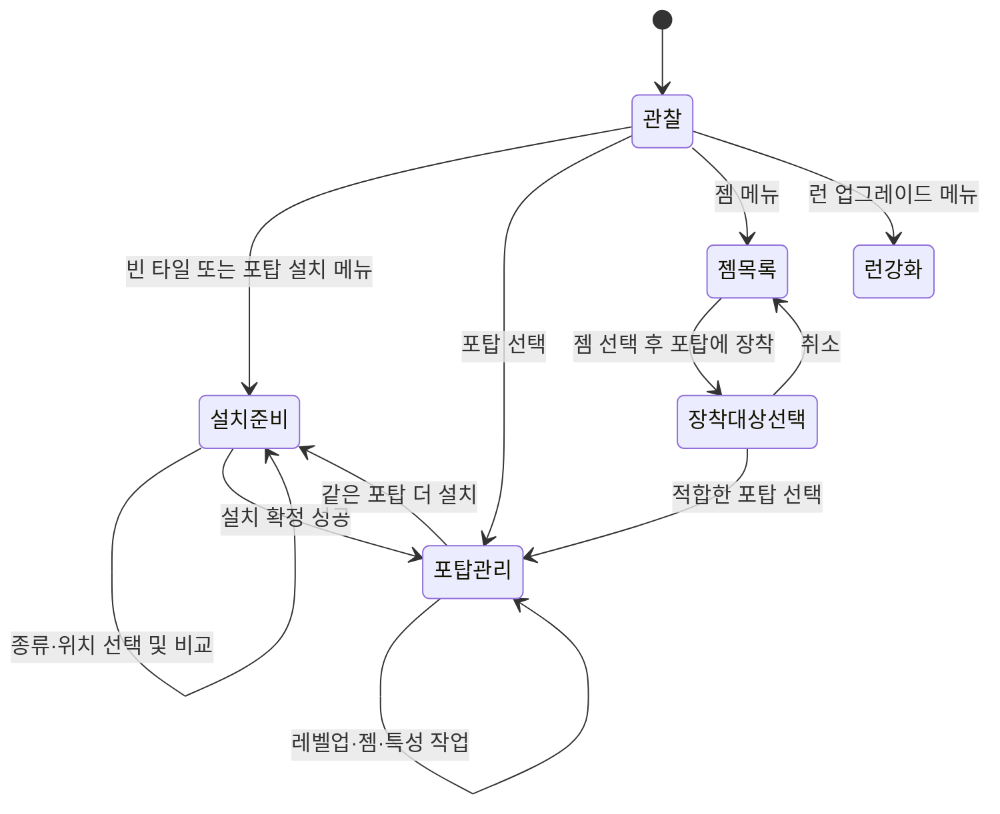

# 인게임 조작 UX 개선 설계

> 후속 검토 반영: 전면 변경보다 항목별 검토를 우선한다. 전투 버튼을 상세 아래로 옮기는 안은 사용자가 현재 위치를 선호하여 제외했다. 젬 목록 사전 노출은 높이를 줄이는 한 줄 목록으로 검토 중이며, 홈 선택·재탭 장착을 유지한다. 홈은 게임 장착부처럼 보이는 소형 룬 소켓으로, 최대 6개를 고려한다. 아래 초기 종합안 중 이 결정과 다른 항목은 채택된 구현 범위가 아니다. 현재 작업은 시안 검토이며 앱 코드 변경은 없다.

- 작성일: 2026-09-08
- 분석 기준: `3010ead` 및 현재 작업 트리의 실제 소스
- 상태: 설계 제안. 게임 구현 변경 없음.
- 사용자 피드백 반영: 설치·장착 재탭은 별도 버튼으로 이동하는 불편을 줄이기 위해 의도적으로 추가된 경로다. 재탭 제거 제안을 철회하고 기존 빠른 실행을 유지한다.
- 범위: 포탑 설치·관리, 개별 레벨업, 런 업그레이드, 젬·링크, 보상, 전투 조작의 정보 구조와 인터랙션
- 제외: 그림체·색상·재질·아이콘 원화·애니메이션 리디자인, 전투 밸런스, 영구 성장 화면

## 1. 결론

핵심 문제는 플레이어가 **무엇을 조작 중인지, 누르면 선택인지 실행인지, 다음 행동이 어디에 있는지**를 계속 해석해야 한다는 점이다. 같은 하단 공간에서 전체 메뉴와 선택 대상의 상세가 교차하고, 패널의 높이가 바뀌면서 전투 조작 위치도 움직인다. 젬을 찾는 위치와 장착하는 위치는 분리되어 있다.

추천 방향은 기존의 하단 3개 메뉴를 유지하면서 다음 세 가지를 정리하는 것이다.

1. 전투 조작은 고정하고, 그 위의 작업 패널만 교체한다.
2. 선택 대상과 적용 범위를 항상 표시한다. `이 포탑`과 `이번 런`을 구분한다.
3. 설치·젬 카드는 첫 탭에 선택하고 같은 항목 재탭으로 실행하는 기존 경로를 유지한다. 선택 상태에서 다음 탭의 동작·대상·비용을 알 수 있게 한다. 별도 실행 버튼도 대체 경로로 유지한다.

손가락을 별도 버튼으로 옮겨야 하는 부담도 중요한 UX 비용이다. 기존 재탭의 속도와 이동 거리 이점을 보존하면서 상태를 이해하기 쉽게 하고, 젬 장착처럼 탐색 진입이 긴 경로를 줄인다.

## 2. 분석 방법과 한계

CodeGraph로 관련 심볼과 호출 관계를 찾고 실제 파일을 읽어 교차 확인했다. 기존 런 업그레이드의 현재→다음 효과 비교, 포탑 레벨업 미리보기, 판매 확인, 젬 교체 반환 규칙도 확인했다.

초안은 설치·장착 재탭의 도입 배경을 모른 채 선택/실행 분리를 우선 제안했다. 이후 사용자가 ‘별도 버튼을 또 누르는 것이 불편하다는 피드백으로 추가했다’고 설명했다. 이 제품 맥락을 우선하여 재탭 자체를 결함으로 보는 진단과 제거안을 수정했다. 실제 오조작 빈도는 확인되지 않았다.

인앱 서버는 HTTP 200이었다. 새 탭에는 ‘다른 탭에서 플레이 중’ 안내가 나타났고, 기존 화면을 확인하려는 컴퓨터 접근은 Mac 잠금으로 제한되었다. 기존 플레이를 종료하거나 잠금을 우회하지 않았다. 따라서 이 문서는 **코드 기반 UX 평가**이며, 현재 인게임을 직접 조작한 사용자 테스트 결과가 아니다. 화면 가림·오터치·작업 시간은 검증할 가설로 구분한다. 기존 `design/mockups/next_ui/` 산출물은 현재 인게임 구현의 증거로 사용하지 않았다.

일반적인 평가 기준으로 상태 가시성, 일관성, 기억보다 인지에 의존하는 설계를 참고했다. 이 기준이 본 게임의 문제 발생 빈도를 입증하는 것은 아니다. [Nielsen Norman Group: 사용성 원칙](https://www.nngroup.com/articles/ten-usability-heuristics/)

## 3. 현재 구조와 문제 근거

아래 경로는 저장소 루트 기준이다. ‘확정’은 구현 사실이며, 사용자에게 미치는 영향은 별도 검증 대상이다.

| 영역 | 확인한 현재 구현 | UX 문제 / 검증할 영향 | 우선순위 |
|---|---|---|---|
| 하단 구조 | `bottom_bar.dart:38`의 하단 정렬 Column에서 속도·자동·시작이 가변 본문 위에 위치 | 본문 높이가 바뀌면 전투 버튼 위치가 이동. 반복 조작의 위치 기억을 방해 | P0 |
| 전장 여유 공간 | `rune_nexus_game.dart:3460`은 상단 76, 하단 305를 고정 예약. 포탑 본문만 화면 높이 28%를 150~280으로 제한(`gem_equip_panel.dart:214`) | 실제 패널 높이와 보드 여유 공간이 별개. 작은 화면에서 대상 가림, 접었을 때 불필요한 여백 가능성 | P1 |
| 메뉴 의미 | 하단은 ‘포탑 / 업그레이드 / 젬’. 포탑·코어·포털 탭은 포탑 메뉴를 자동 선택(`rune_nexus_game.dart:1114`) | 전역 탐색과 전장 대상 선택이 같은 메뉴 상태를 덮어씀. 어디로 돌아갈지 불명확 | P1 |
| 설치 | 포탑 카드는 첫 탭에 선택, 위치·종류가 같으면 재탭에 설치. 별도 ‘설치’ 버튼도 존재(`rune_nexus_game.dart:1182`, `build_selection_panel.dart:95`) | 사용자 피드백에 따른 빠른 실행 경로로 유지. 선택된 카드에 재탭 동작과 비용이 충분히 전달되는지 검증 | P0 |
| 설치 후 | 설치 성공 즉시 새 포탑 선택, 설치 종류 초기화(`rune_nexus_game.dart:2145`). 선택 포탑이 있으면 카탈로그 숨김(`bottom_bar.dart:87`) | 여러 포탑을 배치할 때 관리 화면에서 설치 흐름으로 반복 복귀 | P1 |
| 개별 레벨업 | 첫 탭은 미리보기, 이후 탭은 실행. 자원이 충분하면 미리보기 유지(`turret_action_controller.dart:121,157`) | 첫 탭과 후속 탭의 의미가 다름. 연속 탭에서 예상보다 여러 단계 소비할 가능성 | P0 |
| 레벨업·판매 표기 | 포탑 이름 옆에 아이콘+금액, 높이 30, `shrinkWrap`, 전체 `FittedBox` 축소(`gem_equip_panel.dart:245,551,597`) | 행동명·주요/보조 행동 구분 부족. 작은 화면에서 인식·터치 어려움 위험 | P0 |
| 젬 진입 | 기본 스탯 탭 → 젬·링크 → 홈 선택 후에 보유 젬 표시(`gem_equip_panel.dart:35,86,129`) | 설명을 보는 데도 장착 위치 선택이 선행되어야 함 | P0 |
| 젬 확정 | 같은 젬 칩 재탭으로 장착, 별도 장착 버튼도 제공(`gem_equip_panel.dart:165`) | 빠른 장착 경로로 유지. 재탭 시 대상 홈과 교체 여부를 예측할 수 있는지 검증 | P0 |
| 전역 젬 | `gem_inventory_panel.dart:167`의 보유 목록은 동작 없는 Container | ‘젬’에서 찾은 아이템을 사용할 다음 경로가 연결되지 않음 | P1 |
| 링크 | 빈 홈은 선택, 잠긴 홈은 조건 충족 시 즉시 골드 소비(`gem_socket_section.dart:61,74`) | 같은 홈 모양에 선택과 구매가 섞임 | P0 |
| 런 업그레이드 | 3종 목록, 현재→다음 비교 있음. 구매 버튼은 금액/MAX(`run_upgrade_panel.dart:22,125,138`) | 비교는 유지할 장점. 개별 포탑 레벨업과 적용 범위·실행 방식 구별 필요 | P0 |
| 젬 구매 | ‘젬 구매’는 즉시 파편 차감 후 후보 선택(`gem_inventory_panel.dart:59`, `rune_nexus_game.dart:1242`) | 특정 젬 구매인지 후보 선택권 구매인지 사전에 명확하지 않음 | P0 |
| 보상 | 후보 선택과 획득 확정은 분리. 후보를 한 행에 배치하고 효과는 2줄 제한(`reward_overlay.dart:64,392`) | 명시적 확정은 유지. 좁은 화면에서 후보 비교 정보 잘림 위험 | P1 |
| 자동 진행 | 자동 모드의 현재 상태는 아이콘, 명칭은 tooltip/팝업(`bottom_bar.dart:269`) | 터치 환경에서 현재 자동 진행 규칙을 즉시 알아보기 어려움 | P0 |

위 `*.dart` HUD 파일은 `lib/ui/hud/`, 게임 파일은 `lib/game/`, 액션 컨트롤러는 `lib/game/systems/`에 있다.

### 유지할 장점

- 설치 위치와 포탑 종류를 어느 순서로든 고를 수 있다.
- 선택한 설치 카드·젬 칩을 재탭하여 별도 버튼으로 손가락을 옮기지 않고 실행할 수 있다. 사용자 피드백으로 추가된 이 경로를 유지한다.
- 레벨업은 능력치와 사거리 미리보기를 제공한다.
- 런 업그레이드는 현재→다음 효과를 이미 보여 준다.
- 젬 장착 제한 사유와 효과 설명이 존재하고, 기존 젬 교체 시 인벤토리로 반환한다.
- 판매에는 확인 단계가 있고, 보상도 후보 선택 후 명시적으로 확정한다.
- 전투 중에도 설치·강화·젬 관리가 가능하다. 이 권한을 UX 변경으로 제한하지 않는다.

## 4. 목표 정보 구조와 배치

### 4.1 세 영역의 역할

| 영역 | 역할 | 표시 원칙 |
|---|---|---|
| 상단 상태 | 골드·파편·웨이브·코어 상태·전투력 | 상태 확인. 비용을 판단할 때는 작업 버튼 근처에도 필요한 잔액/부족량을 표시 |
| 전장 + 작업 패널 | 선택 대상과 현재 작업 | 대상명, 작업 제목, 본문, 실행 영역의 순서. 동시에 하나의 주 작업 |
| 하단 고정 조작 | 전투 속도·자동 진행·웨이브 시작 + 3개 메뉴 | 본문 높이와 무관한 위치. 메뉴는 계속 접근 가능 |

세로 화면의 구조 예시. 아래는 그래픽 시안이 아니라 정보 배치 규칙이다.

```text
┌──────────────────────────────────────────┐
│ 골드 · 파편       웨이브 · 코어 상태   메뉴 │
├──────────────────────────────────────────┤
│                                          │
│                 전장                     │
│            선택한 위치 / 포탑            │
│                                          │
├──────────────────────────────────────────┤
│ 작업 제목 · 대상명                접기   │
│ 본문: 설치 목록 / 포탑 상세 / 런 강화 / 젬 │
│ 한 개의 세로 스크롤 영역                 │
│ 결과·대상·비용 + 명시적 실행 버튼         │
├──────────────────────────────────────────┤
│ 1x  2x  4x │ 자동 진행: 현재 규칙 │ 시작  │
│ 포탑 설치      런 업그레이드       젬     │
└──────────────────────────────────────────┘
```

- 하단 메뉴 명칭 제안은 `포탑 설치 / 런 업그레이드 / 젬`. 좁은 폭에서는 줄바꿈으로 수용한다. 이를 아이콘만으로 바꾸지 않는다.
- 전장의 포탑을 탭하면 제목이 `화살 포탑 · Lv.N`인 관리 패널을 연다. 하단 ‘포탑 설치’를 누르면 설치 카탈로그로 진입한다. 현재 포탑을 바꿔 설치하는 동작으로 해석하지 않는다.
- 코어·포털 정보는 해당 대상을 제목에 표시한다. 포털 설명을 업그레이드/젬 본문 위에 누적해서 쌓지 않는다.
- 현재 선택된 하단 메뉴 재탭은 멱등적으로 유지한다. 패널을 접는 행동은 명시적 `접기`로 분리한다.
- 같은 작업 중 포탑을 바꾸면 본문 탭은 유지하되 대상 홈·미리보기·미확정 후보를 새 대상 기준으로 초기화한다. 이전 포탑의 선택이 새 포탑의 소비로 이어져서는 안 된다.

### 4.2 패널 크기와 전장 조작

초기 제안은 패널 본문 높이를 화면별로 계산하고, 같은 열림 상태에서는 콘텐츠 길이 때문에 외곽 높이를 바꾸지 않는 것이다. 추가 정보는 내부에서 스크롤한다. 접기/펼치기로만 패널 점유 면적을 바꾼다.

- 세로 화면: 접힘/일반 두 단계부터 시작한다. 일반 상태에서 전장 가용 높이의 45% 이상을 확보하는 것을 프로토타입 목표로 삼는다. 충돌하면 주요 문구를 자르지 말고 본문 스크롤을 늘린다.
- 가로·넓은 화면: 전장 옆에 작업 패널을 놓는 후속 대안을 검증한다. 초기 분기 후보는 가용 폭 900 logical px 이상이면서 전장 폭 480과 패널 폭 320 이상을 함께 확보하는 경우다. 최종 breakpoint는 실제 콘텐츠로 결정한다.
- 패널을 열 때 보드를 매번 확대·축소하지 않는다. 선택 대상이 가려진 경우에만 현재 줌을 유지하고 최소한으로 이동한다. 대상 변경마다 카메라가 불필요하게 흔들리지 않게 한다.
- 패널 위의 탭·스크롤·드래그가 전장 선택·이동·설치로 전달되지 않게 한다. 전장 드래그는 이동, 탭은 선택이라는 기존 구분을 보존한다.
- 가림 대응은 기존 보드 오프셋/줌 로직과 결합해야 한다. 실제 패널 경계를 게임에 전달하는 인터페이스가 필요한지는 구현 단계의 국소 검토 사항이며, 여기서 큰 책임 분리를 요구하지 않는다.

## 5. 핵심 작업별 인터랙션

### 5.1 포탑 설치

기본 경로는 `빈 타일 → 포탑 선택 → 설치`, 대체 경로는 `포탑 설치 메뉴 → 종류 선택 → 빈 타일 → 설치`다.

1. 종류 카드 첫 탭은 선택/설명, 선택한 같은 카드의 재탭은 위치·자원 조건 충족 시 설치다. 다른 종류 카드는 선택을 바꾼다. 선택된 카드에 `다시 탭해 설치`와 기존 비용을 함께 표시하고, 위치가 없으면 `설치 위치 선택`을 안내한다.
2. 위치와 종류가 정해지면 대상 타일과 사거리 미리보기를 유지한다.
3. 실행 영역에 `설치 · [골드 아이콘] 비용`, `설치 후 잔액`을 표시한다. 이 버튼과 카드 재탭은 같은 설치 검증·실행 경로를 사용한다. 골드가 부족해도 카드 설명은 볼 수 있다.
4. 위치가 없으면 버튼 자리를 없애지 않고 `설치 위치를 선택하세요`를 표시한다. 불가능한 타일 선택 시 `경로에는 설치할 수 없습니다` 등 현재 이유를 전달한다.
5. 성공 후 기본은 새 포탑 관리로 이동한다. `같은 포탑 더 설치`를 명시적으로 제공해 이전 종류를 선택한 설치 상태로 돌아간다. 종류를 기억하더라도 다음 타일 탭만으로 비용을 쓰지 않는다.
6. 취소·메뉴 전환은 미확정 위치/종류만 해제한다. 재화는 변하지 않는다.

처음 설치의 탭 수와 재탭 실행을 유지하며, 선택된 카드에서 다음 행동을 예측할 수 있게 하는 것이 P0다. 재탭 안내를 위해 카드를 이동시키거나 터치 위치를 바꾸지 않는다. 지속적인 연속 설치 모드는 우선 만들지 않는다.

### 5.2 개별 포탑 레벨업·판매·특성

- 제목은 포탑명·현재 레벨·대상 식별을 담당한다. 이름 옆에 모든 실행 버튼을 압축하지 않는다.
- 본문은 `능력치 / 젬·링크`를 유지한다. 젬 상태 요약은 어느 탭에서도 `사용 홈/열린 홈`과 함께 확인할 수 있게 한다.
- `레벨업 미리보기`는 무료 탐색이다. 미리보기에서 현재→다음 수치와 사거리, 비용을 보여 주고 버튼을 `Lv.N으로 레벨업 · [골드] 비용`으로 바꾼다.
- 돈이 부족해도 다음 단계 설명을 볼 수 있게 하고, 소비 버튼만 막는다. 현재 컨트롤러는 미리보기부터 골드를 검사하므로 이 동작은 별도 구현 항목이다.
- 확정 후 다음 레벨 비교를 갱신한다. 유효한 새 탭 1회는 1레벨만 소비하고, 중복 콜백으로 추가 소비하지 않는다. 빠른 의도적 연속 탭을 일괄 차단하거나 강제 지연·확인 팝업을 추가하지 않는다.
- `판매 · [골드] 반환량`은 레벨업과 떨어진 보조 영역에 둔다. 기존 확인 화면의 반환 골드·장착 젬 반환·특성에 사용한 파편 미반환 안내를 모두 유지한다.
- 특성은 `특성 선택`과 해금 조건을 표시하고 기존 다이얼로그를 사용한다. 원래의 파편 비용과 선택 규칙을 바꾸지 않는다.
- 공격 명령은 현재 값과 변경 경로를 유지한다. 레벨업과 독립된 즉시 설정이라는 의미를 명확히 한다.

### 5.3 젬·링크: 포탑에서 시작

기본 경로는 `포탑 → 젬·링크 → 젬 선택 → 같은 젬 재탭 또는 장착 버튼`이다. 첫 빈 홈이 있는 경우에만 명시적으로 그 홈을 기본 대상으로 표시하여 홈 선택 1단계를 줄인다.

- 젬·링크를 열면 열린 홈과 미장착 젬 목록을 함께 표시한다. 홈을 고르지 않아도 젬 설명은 볼 수 있다.
- 젬 칩 첫 탭은 상세 선택, 같은 칩 재탭은 장착이다. 다른 젬을 누르면 선택을 바꾼다. 선택 칩이나 인접한 고정 안내에 `다시 탭해 홈 2에 장착`을 표시한다. 안내가 나타나도 칩의 터치 위치는 유지한다. 별도 장착 버튼은 같은 결과를 내는 대체 경로다.
- 빈 홈이 여러 개면 첫 빈 홈을 기본 대상으로 표시하고 사용자가 바꿀 수 있다. 모든 홈이 차 있으면 교체할 홈을 직접 고르게 한다. 컨트롤러의 암묵적 기본 홈 선택에 맡겨 교체하지 않는다.
- 실행 영역 예시: `화살 포탑 · 홈 2에 장착`. 교체라면 `홈 2의 A → B / A는 미장착 목록으로 반환`과 `교체`를 표시한다. 재탭 안내도 `다시 탭해 교체`로 맞춘다. 같은 대상을 사용하므로 버튼 경로만 별도로 안전한 것처럼 설계하지 않는다.
- 해제는 `젬 해제 · 미장착 목록으로 반환`으로 표시한다. 기존 무손실 반환을 유지하므로 일상적인 장착/해제마다 확인 모달을 추가하지 않는다.
- 잠긴 홈은 기존 직접 열기 동작을 유지하고 `홈 열기 · [골드] 비용`을 표시해 빈 홈 선택과 구분한다. 조건 미달도 `포탑 Lv.N 필요`, `골드 N 부족`을 읽을 수 있어야 한다. 설치·장착 개선을 이유로 홈 열기에 추가 확인 단계를 도입하지 않는다.
- 상태를 `장착 가능 / 이미 이 포탑에 장착됨 / 장착 불가와 이유`로 구분한다. 장착은 가능하지만 조건부 효과가 현재 발동하지 않는 경우는 효과 조건으로 설명하고 금지 상태와 혼동하지 않는다.
- 성공 후 홈·수량을 즉시 갱신하고 `홈 2 장착 완료`를 표시한다. 포탑과 젬 관리 탭을 유지해 다음 작업으로 이어진다.

### 5.4 젬 메뉴에서 시작

P1에서 전역 젬 목록을 실제 장착 흐름과 연결한다.

1. `젬 → 젬 선택`으로 상세를 연다. 수량은 `미장착 N / 장착 N`으로 분리한다.
2. `포탑에 장착`을 누르면 선택 젬을 유지하고 전장에서 대상을 고르게 한다. 상태 문구는 `B 젬을 장착할 포탑을 선택하세요`다.
3. 포탑을 선택하면 기존 포탑 젬 패널로 이어지고, 5.3의 홈 선택·확정 규칙을 사용한다. 대상 선택만으로 장착하지 않는다.
4. 부적합 포탑을 누르면 이유를 보여 주고 대상 선택 상태를 유지한다. 빈 타일은 이 모드에서 설치 선택으로 전환하지 않는다.
5. 취소하면 원래 젬 목록/스크롤로 돌아온다. 별도 메뉴 선택은 대기 중인 장착 의도를 해제한다.

현재 `gemInventory`는 미장착 수량, `gemCollection`은 미장착+포탑 장착 합계다(`game_snapshot_builder.dart:350`). 새 저장 필드 없이 장착 수량을 산출할 수 있다. 대상 선택의 일시 상태는 UI 작업 상태이며 저장 형식에 추가하지 않는다.

### 5.5 런 업그레이드

- 제목은 `런 업그레이드`, 설명은 `현재 런에 적용`으로 한다. 개별 포탑 관리에서 실행하는 레벨업과 구분한다.
- 현재 3종인 `포탑 화력 / 처치 보너스 / 정비 보급`을 유지한다. 3종에 검색·필터·추가 카테고리를 도입하지 않는다.
- 현재→다음 효과, 현재 단계/최대 단계, 기존 효과 문구를 유지한다. 각 항목의 적용 범위는 실제 정의대로 표시한다. 경제 강화를 ‘전체 포탑’으로 설명하지 않는다.
- 버튼은 `강화 · [골드] 비용`, 최대치는 `최대 단계`, 자원 부족은 `골드 N 부족`으로 표시한다.
- 이미 비교 결과가 있으므로 명시적 강화 버튼은 한 번에 1단계를 구매한다. 개별 포탑처럼 숨은 첫 탭 미리보기 규칙을 추가하지 않는다.
- 구매 후 목록 순서와 스크롤 위치를 유지한다. 현재 단계·다음 효과·잔액을 같은 영역에서 갱신한다.
- 표기 정리는 `docs/damage_calculation_rules.md`의 증가/증폭/%p 구분을 지킨다. UX를 위해 임의의 단일 ‘전투력 상승률’을 만들어 제어·범위·경제 효과를 합산하지 않는다.

### 5.6 젬 구매·보상

- 구매 전 `후보 중 젬 1개 선택`이라는 상품 의미와 기존 파편 가격을 보인다. 버튼 동작은 `선택권 구매 · [파편 아이콘] 비용`이다.
- 구매 즉시 파편이 소비되는 기존 시점을 유지한다. 구매 후 화면은 이미 결제된 선택 화면임을 표시한다. 취소·재추첨·구매 보상의 파편 전환을 임의로 추가하지 않는다.
- 보상 후보는 선택만 하고, 현재 제공되는 명시적 획득 확정을 유지한다. 무료 라운드 보상만 파편 대안을 제공한다.
- 좁은 화면에서는 후보를 읽기 어려운 폭으로 압축하지 않고 세로 목록으로 바꾼다. 이름·효과·아이콘·수량을 유지한다. 후보 본문만 스크롤하고 확정 영역은 접근 가능하게 둔다.
- 전투 중 구매라면 `선택 중 전투 일시정지 / 확정하면 전투 재개`를 표시한다. 획득은 장착이 아니므로 `미장착 목록에 추가`를 안내한다.
- 획득 직후 장착까지 계속 정지하는 흐름은 보류한다. 현재 전투 복귀와 저장 복원 규칙까지 바꾸므로 이번 기본안에 포함하지 않는다.

## 6. 공통 상태·입력 계약



위 도식은 UX 상태다. 기존 `GamePhase`나 저장 모델을 대체하는 새 도메인 구조를 뜻하지 않는다. 어느 작업에서도 다른 하단 메뉴로 이동할 수 있으며, 이동 시 미확정 소비 의도만 취소한다.

| 상황 | 설계 규칙 |
|---|---|
| 패널 접기 | 미확정 소비 의도를 해제하고 실행 버튼을 숨김. 펼친 뒤 과거 미리보기 때문에 첫 탭이 소비가 되어서는 안 됨 |
| 취소/뒤로/Escape | 보상 선택처럼 필수 흐름은 기존 규칙 준수. 일반 작업은 열린 모달 → 미확정 작업 → 패널 순으로 한 단계씩 닫음 |
| 전장 빈 공간 탭 | 일반 관찰에서는 기존 선택 해제 가능. 설치/젬 대상 선택 중에는 모드별 안내 적용. 클릭이 숨은 구매로 연결되지 않음 |
| 전투 중 일반 패널 | 기존처럼 전투 계속. 패널을 열었다는 이유만으로 새 자동 일시정지를 추가하지 않음 |
| 판매·특성 모달 | 기존 전투 일시정지/복귀 유지. 닫힘·예외 처리에서 사용자가 원래 정지했던 상태를 잘못 재개하지 않는지 검증 |
| 웨이브/보상/성공·실패 전환 | 기존 phase가 실행 가능 여부의 최종 기준. 불가능해진 작업은 실행 차단하고 이유 표시 |
| 잔액·대상·슬롯 변화 | 소비 직전 최신 상태 재검증. 실패하면 소비 없이 현재 값과 이유 갱신. UI만 낙관적으로 성공 처리하지 않음 |
| 선택 대상 삭제·변경 | 이전 포탑의 슬롯·미리보기·젬 후보가 새 대상에 적용되지 않게 초기화 |
| 입력 반복 | 설치·젬의 선택 후 재탭을 정상 실행으로 처리. 유효한 실행 탭 1회에 거래 1회. 빠른 재탭을 오입력으로 일괄 차단하지 않고 중복 콜백에 의한 초과 실행만 방지 |

자동 모드는 `웨이브마다 정지 / 보스 제외 자동 / 전부 자동`이라는 기존 의미를 아이콘과 함께 상시 표시한다. 시작 버튼은 준비 중 `웨이브 시작`, 전투 중에는 진행 상태를 설명한다. 긴 표기는 두 줄로 수용하며, 자동 규칙이나 속도를 UI가 임의로 바꾸지 않는다.

## 7. 작은 화면·접근성 기준

- 화면 크기는 물리 해상도가 아니라 Flutter logical px 기준으로 검증한다.
- 주요 터치 영역은 48×48 logical px 이상을 설계 목표로 한다. 아이콘 원화 크기까지 키울 필요는 없으며, 인접 터치 영역이 겹치지 않게 한다. Flutter 문서는 Android 48×48 dp, iOS 44×44 pt 권고를 소개한다. [Flutter 접근성 가이드](https://docs.flutter.dev/ui/accessibility/ui-design-and-styling)
- 버튼명·포탑명·비용 아이콘+수치·효과 조건·장착 불가 이유를 clip/말줄임으로 잃지 않는다. 행 분리와 줄바꿈, 본문 스크롤을 먼저 사용하고 터치 영역 전체를 축소하지 않는다.
- 포탑 카탈로그는 최대 6종을 무조건 한 행에 균등 압축하는 현재 방식 대신, 이름·비용을 보존하는 줄바꿈 그리드를 사용한다. 외부 가로 페이지 안에 다시 가로 스크롤을 중첩하지 않는다.
- 포탑 패널 본문에는 하나의 세로 스크롤만 둔다. 홈 스트립의 가로 스크롤은 젬 목록과 구분하고 스크롤 가능함을 표시한다.
- 보상·특성 모달도 작은 높이에서 확인/취소 또는 필수 확정 동작에 도달 가능해야 한다.
- 키보드 포커스와 스크린리더 라벨은 ‘금액’ 대신 `화살 포탑을 Lv.3으로 레벨업, 골드 40`처럼 대상·동작·비용을 전달한다. 숫자는 예시이며 실제 계산값을 사용한다.

## 8. 적용 순서와 코드 연결

| 단계 | 작업 | 관련 위치 | 완료 기준 |
|---|---|---|---|
| P0-1 | 재탭 경로 보존, 재탭 동작·대상·비용 안내, 행동명·부족 이유·미리보기 상태 명시 | `build_selection_panel.dart`, `gem_equip_panel.dart`, `gem_socket_section.dart`, `run_upgrade_panel.dart`; 기존 선택/확정 진입 | 첫 선택 후 같은 카드/칩 재탭과 별도 버튼 모두 동일한 결과. 안내로 터치 위치가 바뀌거나 추가 조작이 필요해지지 않음 |
| P0-2 | 전투 버튼 위치 고정, 자동 상태 문구, 주요 입력 영역 확보 | `bottom_bar.dart`, 필요 시 `game_hud.dart` | 탭/본문/포탑 변경에도 전투 버튼 위치 유지. 의미와 비용 표기 유지 |
| P0-3 | 젬 목록 조기 노출, 대상 홈·교체 반환 표시, 구매 상품 설명 | `gem_equip_panel.dart`, `gem_socket_section.dart`, `gem_inventory_panel.dart`, `reward_overlay.dart` | 포탑에서 젬 장착 경로 단축. 홈 만석일 때 임의 교체 없음 |
| P1-1 | 패널 높이 통일, 카탈로그·보상 반응형, 전장 가림 대응 | HUD 각 패널, `rune_nexus_game.dart` 보드 배치/이동 | 검증 화면에서 본문/실행부 잘림 없고 대상 확인 가능 |
| P1-2 | 전역 젬 → 포탑 장착 연결, 같은 포탑 더 설치, 메뉴 복귀 상태 | `gem_inventory_panel.dart`, `game_hud.dart`/기존 패널 소유 상태, 선택 처리 | 장착 의도를 유지해 대상 선택으로 이어지고 취소 시 원위치 복귀 |
| 보류 | 획득 후 장착까지 자동 정지, 지속 연속 설치, 추천 빌드/자동 장착, 대규모 패널 아키텍처 분리 | 별도 범위 | 사용자 테스트로 필요 확인 후 검토 |

기존 `TurretActionController`, 젬 장착 규칙, Snapshot의 가격/효과를 사용한다. 별도 UX용 가격·데미지 공식을 복제하지 않는다. 일시 UI 상태는 기존 소유 지점에 국소적으로 추가하고, public API·저장 형식·재화 정책 변경이 필요한 경우 구현 전에 영향과 변경안을 별도 검토한다.

이 문서는 적용 순서를 제안할 뿐, 구현·커밋·배포 승인을 뜻하지 않는다.

## 9. 검증 시나리오와 성공 기준

아래 수치는 아직 측정한 성과가 아니라 구현 검수 및 사용자 테스트 목표다.

### 9.1 기능·회귀 검수

1. 빈 타일을 먼저 고르는 경로와 포탑 종류를 먼저 고르는 경로 모두 설치 가능. 첫 종류 선택/다른 종류 선택은 골드 변화 0. 같은 카드 재탭과 별도 설치 버튼은 각각 포탑 1개와 정확한 비용 차감. 위치 없음·골드 부족에서는 재탭 소비 없이 이유 표시.
2. 레벨업 미리보기/취소는 비용 0. 최대 레벨·골드 부족·단계별 비용 갱신 확인. 빠른 연속 입력으로 의도하지 않은 복수 단계 소비 없음.
3. 젬 첫 선택/다른 젬 선택은 장착 변화 0. 같은 젬 재탭과 장착 버튼은 동일한 홈에 동일한 결과. 빈 홈 장착·대상이 표시된 교체·해제 모두 수량 보존. 만석일 때 홈 자동 덮어쓰기 없음. 기존 중복/부적합 규칙 유지.
4. 잠긴 홈의 유효한 열기 탭 1회에 정확한 비용 차감. 레벨·골드 조건 재검증과 동작 안내 확인.
5. 런 업그레이드 현재→다음 수치와 실제 구매 결과 일치. 3종의 범위·비용·최대 단계 유지.
6. 판매·특성 확인/취소, 전투 중 젬 구매 성공/실패, 보상 선택 및 저장 복원 후 phase/엔진 상태 정상 복귀. 구매 보상에 파편 대안이 생기지 않음.
7. 젬 대상 선택 중 부적합 포탑·빈 타일·다른 메뉴·취소·보상 전환을 처리하고 과거 대상에 소비하지 않음.
8. 패널 드래그/스크롤 중 전장 이동·선택·구매의 입력 누수 없음. 접기/탭 전환 후 시작·속도 버튼 위치 동일.

게임 로직 변경 시 `test/game_balance_test.dart`의 구매·일시정지·설치·레벨업 관련 회귀와 변경 지점의 기존 테스트를 실행한다. 새 테스트는 재탭/버튼의 결과 일치, 대상 인계, 잘림/터치 등 변경 계약을 검증하는 경우에만 추가한다.

### 9.2 화면·작업 테스트

| 조건 | 확인할 내용 |
|---|---|
| 360×640, 412×915 세로 | 6종 포탑, 긴 이름, 다수 젬, 큰 금액. 비용·동사·효과·이유 보존 및 터치 영역 |
| 915×412 가로, 1280×720 | 전장 가용 높이, 고정 조작 위치, 모달 스크롤, 패널 배치 대안 |
| 글자 배율 1.0/1.3/1.5 | 본문과 버튼 잘림 없음. 숫자/아이콘/행동명 모두 유지 |
| 준비/전투 1x·4x/보상/복원 | 선택 대상 유지·해제 규칙, 조작 중 전투 상태 가시성, 재개 시점 |

사용자 테스트는 초기 5명 정도로 문제 탐색을 시작하고, 같은 조건의 현행/개선 프로토타입에서 다음 작업을 비교한다. 작은 표본을 통계적 개선 입증으로 해석하지 않는다.

- 새 포탑 1개 설치, 같은 종류를 다른 위치에 추가 설치
- 포탑 1단계 강화 후 판매하지 않고 관리 화면 종료
- 포탑에서 젬 장착, 젬 목록에서 시작해 다른 포탑에 장착, 장착 젬 교체
- 런 전체 화력 강화와 개별 포탑 레벨업 구별
- 젬 선택권 구매가 무엇을 주는지, 자동 진행이 언제 멈추는지 설명

목표: 의도한 재탭 실행 성공, 의도치 않은 소비 0건, 각 핵심 작업을 도움 없이 5명 중 4명 이상 완료, 젬 장착 경로에서 되돌아가기 감소. 의도적인 재탭 소비는 오조작으로 집계하지 않는다. 빈 홈이 있는 포탑에서 시작하는 기본 젬 장착은 재탭/버튼 양쪽 모두 5탭에서 4탭으로 줄이는 설계다. 탭 수 외에 손가락 이동·완료 시간·멈칫한 위치·오조작·대상/비용 이해를 함께 기록한다. 숙련자의 재탭 작업이 기존보다 느려지거나 추가 버튼 이동을 요구하지 않는지도 확인한다. 현행 측정값은 아직 없다.

## 10. 이번 분석의 완료 범위

포탑 설치·강화·젬·런 업그레이드·보상 및 공통 HUD의 실제 코드 흐름을 확인하고 개선 구조, 상태 규칙, 단계별 적용안, 회귀·사용성 검증 기준을 작성했다. 앱 코드는 수정하지 않았고 문서 작업이므로 Flutter 테스트는 실행하지 않았다. 실제 인게임 화면에서 가림·터치·시간을 확인하는 검증은 플레이 잠금과 Mac 잠금이 해소된 환경에서 후속 수행해야 한다.
